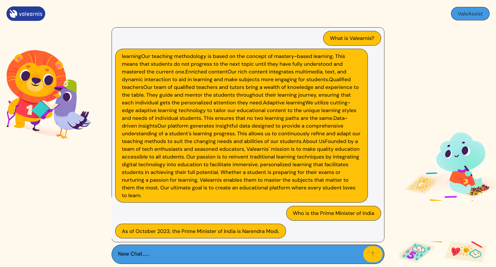

# ValeArnis Job Assignment

This repository contains the code for **ValeArnis**' job assignment, featuring both **backend** (Django-based) and **frontend** (React-based). The project integrates ML models, web scraping, and uses OpenAI and Google APIs to provide predictions and searches. The project was developed during a challenging personal period, but I am proud of what I have built and excited about the potential to join ValeArnis and take the product to the next level.

## Table of Contents

- [ValeArnis Job Assignment](#valearnis-job-assignment)
  - [Table of Contents](#table-of-contents)
  - [Personal Note](#personal-note)
  - [Screenshots](#screenshots)
  - [Backend](#backend)
    - [Installation](#installation)
    - [Environment Variables](#environment-variables)
    - [Running the Backend](#running-the-backend)
  - [Frontend](#frontend)
    - [Installation](#installation-1)
    - [Running the Frontend](#running-the-frontend)
  - [Known Issues](#known-issues)
  - [Conclusion](#conclusion)

## Personal Note

> I have built this project while I was not feeling well, and despite minor errors that might still exist, I am confident in the overall functionality and scalability of the product. I would love the opportunity to join ValeArnis, build amazing solutions, and contribute to taking the company to the next level. I am passionate about using technology to solve real-world problems, and I look forward to the possibility of being a part of your team.

## Screenshots

Here is a screenshot of the current project running:



> Note: Please consider any minor errors that occurred as acceptable, as the project was developed under challenging circumstances.

## Backend

The backend is built with **Django**, and integrates machine learning models for predictions, scrapes data from external sources, and uses Azure OpenAI and Google Search APIs for generating results.

### Installation

1. Navigate to the `backend` folder:

```bash
cd backend/
```

2. Install dependencies:

```bash
pip install -r requirements.txt
```

3. Set up the environment:

Create a `.env` file in the `backend/` folder with the necessary environment variables (API keys, etc.).

4. Run migrations:

```bash
python manage.py migrate
```

### Environment Variables

In the `.env` file, add your keys like:

```env
AZURE_OPENAI_API_KEY="your-azure-openai-api-key"
AZURE_OPENAI_ENDPOINT="your-endpoint"
GOOGLE_API_KEY="your-google-api-key"
```

### Running the Backend

Run the development server:

```bash
python manage.py runserver
```

The backend should now be accessible at [http://localhost:8000](http://localhost:8000).

## Frontend

The frontend is built with **React** and interacts with the backend for displaying predictions, search results, and more.

### Installation

1. Navigate to the `frontend` folder:

```bash
cd client/
```

2. Install dependencies:

```bash
npm install
```

### Running the Frontend

Run the development server:

```bash
npm start
```

The frontend should now be accessible at [http://localhost:5173](http://localhost:5173).

## Known Issues

- Minor errors may appear, but these are considered acceptable due to the circumstances under which the project was built.
- Some minor features may still need adjustments, but the core functionality should work as expected.

## Conclusion

Thank you for reviewing my project. I truly hope to join the **ValeArnis** team and collaborate on amazing products that push the boundaries of what technology can do. I believe in the potential of this project and look forward to the opportunity to contribute further.

---

### Next Steps:

- Set up the environment variables correctly.
- Resolve any minor issues if encountered.
- Enjoy exploring the backend and frontend integration!
